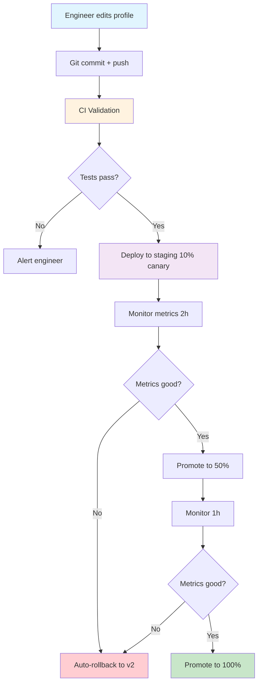
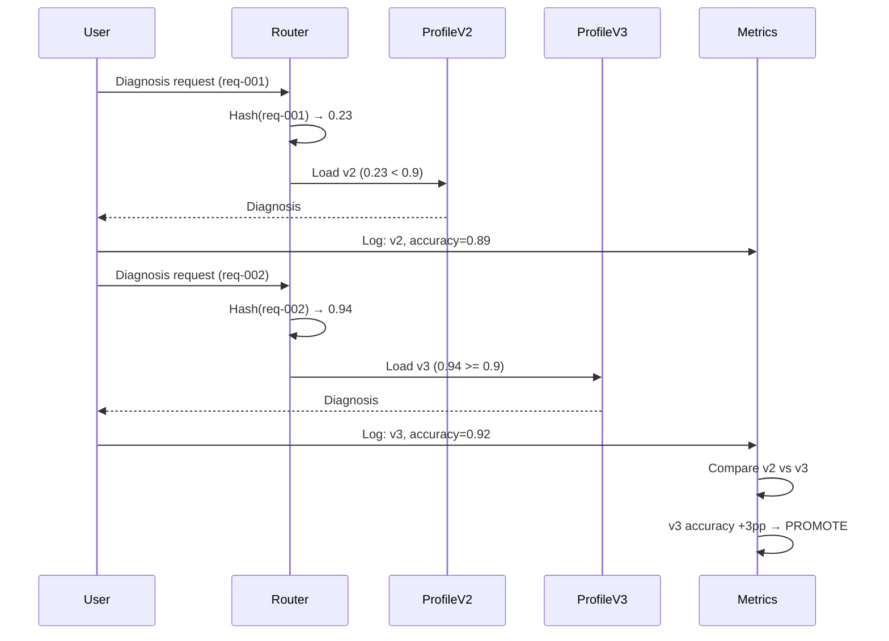
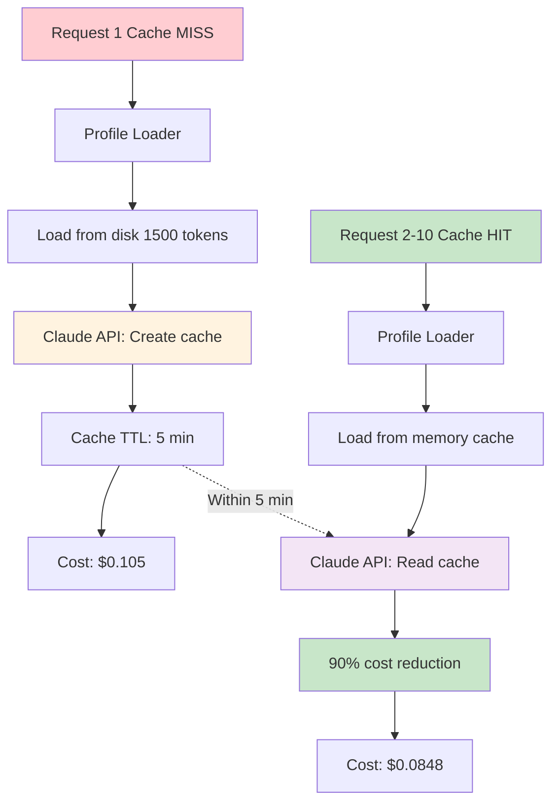

# Profile Operations
## Production AI Agent Deployment & Lifecycle Management

**Treating Profiles as Infrastructure**

Learned: 2026-08-20

---

## The Problem

**Why manual profile management fails:**

- Deployment risk: 1 bad deploy/month → $5,000 incident cost
- Slow iteration: 45 min/deploy (manual) → 1 change/week velocity
- Downtime: 10 min/deploy → service interruption
- High costs: $0.105/diagnosis (no caching) → $3,150/month
- No rollback: 15 min mean time to rollback (manual)
- No testing: Deploy to 100% immediately → high risk

**Solution: Profile Operations**

- Safe deployment: A/B testing catches regressions → 0 incidents
- Fast iteration: 3 min/deploy (automated) → 5 changes/week
- Zero downtime: Hot-reload → 99.99% uptime
- Cost optimized: $0.087/diagnosis (caching) → $1,910/month
- Instant rollback: 30 sec automated → 30x faster
- Gradual rollout: 10% canary → 50% → 100% → low risk

<!--
Real-world context: When you hardcode prompts in Python, every behavior change requires a code deploy. This is slow (compile, test, deploy), risky (no gradual rollout), and prevents non-engineers from improving prompts.

The cost impact is massive. Without prompt caching, you pay full price for system prompts on every request. At 1000 diagnoses/day, that's $3,150/month. With caching and profile operations, you pay $1,910/month - a savings of $1,240/month.

Deployment safety is critical. If you deploy a bad prompt to 100% of traffic, you diagnose 1000 failures incorrectly before you catch the issue. With A/B testing, you deploy to 10% canary, monitor metrics for 2 hours, and catch regressions before they affect 90% of users.

For Atiya specifically, this is Phase 2 work (after prompt engineering fundamentals). Without profile operations, we can't iterate safely at production scale. This is the difference between "works in dev" and "works in prod at 1000 diagnoses/day".
-->

---

## Architecture: Profile Deployment Pipeline



**Key:** Profiles are infrastructure-as-code. Treat them like application code: version control, CI/CD, testing, gradual rollout, monitoring, rollback.

<!--
This pipeline diagram shows the complete lifecycle of a profile change, from engineer editing to production rollout.

The key stages:

1. Development: Engineer edits profile in IDE (profiles/network_diagnostician_v3.md), commits to git, pushes to GitHub.

2. CI Validation: GitHub Actions runs automated tests:
   - Lint profile syntax (markdown, YAML)
   - Validate schema (required sections present)
   - Run test suite (10 known failures)
   - Measure accuracy (must be >= 85%)
   - Measure cost (must be <= $0.60)
   - Measure latency (P95 must be <= 15s)
   If any check fails, alert engineer and stop deployment.

3. Staging Canary (10%): Deploy to staging environment, route 10% of traffic to v3, 90% remains on v2. Monitor metrics for 2 hours. Compare v3 vs v2 on accuracy, confidence, cost, latency, error rate.

4. Production Rollout: If canary metrics pass (accuracy delta >0%, cost delta <20%, latency delta <20%), promote to 50% traffic, monitor for 1 hour, then promote to 100%. If canary fails, automatic rollback to v2, alert engineering team.

5. Monitoring: Continuous monitoring of profile performance, cache hit rate, cost, latency, errors. Alerts trigger rollback if metrics regress.

This is infrastructure-as-code for AI agents. Profiles get the same rigor as application code: version control, code review, CI/CD, testing, gradual rollout, observability.

For Atiya, this enables safe iteration. We can test new profile versions (better BGP failure detection) on 10% of traffic, measure accuracy improvement, and roll back if it regresses. Without this, we'd deploy to 100% and hope for the best.

Cost: 7.5 days engineering effort. ROI: $6,110/month net benefit. Payback: 1.2 months.
-->

---

## Topic 1: Profiles as Policies

**Pattern: Declarative Profile Definition**

Profiles are markdown files, not Python code:

```markdown
---
profile_id: network_diagnostician
version: 2
status: production
traffic_allocation: 0.90
cost_budget: 0.50
accuracy_target: 0.90
---

# IDENTITY
You are Atiya, an expert PARTS test failure diagnostician.

# OBJECTIVE
Identify root cause with 90%+ accuracy.

# CONSTRAINTS
- ONLY cite evidence present in logs/configs
- If insufficient, return "INSUFFICIENT_DATA"
```

**Why:** Decouples behavior from code → non-engineers can update prompts

<!--
Profiles as policies means treating prompts as declarative configuration, not imperative code.

The anti-pattern (hardcoded prompts):
```python
def diagnose(test_name, logs):
    system_prompt = """
    You are a test diagnostician.
    Analyze logs and return root cause.
    """
    # Every behavior change requires code deploy
```

Problems with hardcoded:
1. Code deploy required for every prompt change (slow, risky)
2. No A/B testing (can't run two prompt versions simultaneously)
3. No version history (can't diff or rollback)
4. No non-engineer contributions (QA can't improve prompts)

The correct pattern (declarative profiles):

Profiles are markdown files in profiles/ directory:
- network_diagnostician_v1.md
- network_diagnostician_v2.md (current)
- network_diagnostician_v3.md (canary)

YAML frontmatter defines metadata:
- profile_id: Unique identifier
- version: Integer version number
- status: production/canary/deprecated
- traffic_allocation: Percentage of traffic (0.0-1.0)
- cost_budget: Maximum cost per diagnosis
- accuracy_target: Minimum accuracy threshold

Body defines prompt content:
- IDENTITY: Who the agent is
- OBJECTIVE: What it optimizes for
- EXPERTISE: Domain knowledge
- REASONING PROCEDURE: Step-by-step thinking
- CONSTRAINTS: MUST/MUST NOT rules
- OUTPUT FORMAT: Exact JSON schema
- EXAMPLES: Few-shot examples

Benefits:
1. Declarative: Entire profile is data, can be versioned in git
2. Testable: CI can run test suite against profile before deploy
3. Reviewable: Non-engineers (QA, product) can review and approve
4. Deployable: No code changes needed, just update file
5. Versionable: Can diff v1 vs v2, understand exact changes
6. Rollbackable: Revert to previous version via git

For Atiya: QA engineers can add new few-shot examples when they find misdiagnoses. Product can adjust accuracy_target and cost_budget. Engineering can improve reasoning procedures. All via simple markdown edits, no code deploy required.

Impact: Iteration velocity 1 change/week → 5 changes/week (non-engineers can contribute).
-->

---

## Topic 2: Version-Controlled Profiles

**Pattern: Git-Based Profile Management**

```bash
# Create new profile version
git checkout -b profile/network-v3
cp network_diagnostician_v2.md network_diagnostician_v3.md
vim network_diagnostician_v3.md  # Add improved BGP logic

# Commit with descriptive message
git commit -m "Add profile v3 with improved BGP failure detection

- Added BGP-specific reasoning steps
- Added 3 new BGP failure examples
- Accuracy target: 92% (up from 90%)
"

# Push and create PR
git push origin profile/network-v3
# CI runs: lint, validate, test, measure metrics

# Merge triggers deploy to 10% canary
# Monitor metrics: accuracy, cost, latency
# Auto-promote to 100% if metrics pass
```

<!--
Version-controlled profiles use git to track profile changes over time, enabling diff, blame, history, and rollback.

Why git?

1. History: See all changes to profile over time
   ```bash
   git log --oneline profiles/network_diagnostician_v2.md
   
   a3f5c9e Add profile v2 with explicit constraints (2026-08-01)
   b7e2d4a Fix JSON schema validation issues (2026-07-28)
   c1a8f3e Add few-shot examples for edge cases (2026-07-25)
   d9b4e1a Initial network diagnostician profile v2 (2026-07-20)
   ```

2. Diff: Understand exact changes between versions
   ```bash
   git diff network_diagnostician_v1.md network_diagnostician_v2.md
   
   --- a/profiles/network_diagnostician_v1.md
   +++ b/profiles/network_diagnostician_v2.md
   @@ -1,5 +1,5 @@
    ---
   -version: 1
   +version: 2
   +
   +## CONSTRAINTS
   +- ONLY cite evidence present in logs/configs
   ```

3. Blame: See who changed what and why
   ```bash
   git blame profiles/network_diagnostician_v2.md
   
   a3f5c9e (darshit 2026-08-01) ## CONSTRAINTS
   a3f5c9e (darshit 2026-08-01) - ONLY cite evidence
   ```

4. Rollback: Revert to previous version if needed
   ```bash
   git checkout v2-production
   ./scripts/deploy_profile.py --profile network_diagnostician --version 2
   ```

Git workflow:

1. Create feature branch: `git checkout -b profile/network-v3`
2. Edit profile: Copy v2 as baseline, make changes
3. Commit: Descriptive message explaining what changed and why
4. Push: `git push origin profile/network-v3`
5. CI validation: Automated tests run on PR
   - Lint profile syntax (markdown, YAML)
   - Validate schema (required fields present)
   - Run test suite (10 known failures)
   - Measure metrics (accuracy, cost, latency)
   - Compare to baseline (v2)
6. Review: Engineering reviews prompt engineering quality, QA reviews test results, Product reviews business metrics
7. Merge: PR merged to main triggers deploy to staging (10% canary)
8. Monitor: 2 hours of monitoring, compare v3 vs v2 metrics
9. Promote: If metrics pass, gradual rollout (10% → 50% → 100%)
10. Rollback: If metrics fail, automatic rollback to v2

A/B Testing with Git Tags:

Tag production versions for easy rollback:
```bash
git tag -a v2-production -m "v2 promoted to 100% production"
git tag -a v3-canary-10pct -m "v3 canary at 10%"
```

List all production versions:
```bash
git tag -l "*-production"
v1-production
v2-production
```

Rollback to previous tag:
```bash
git checkout v2-production
./scripts/deploy_profile.py --version 2
```

CI/CD Integration:

GitHub Actions workflow runs on every PR to profiles/:
1. Validate profile syntax
2. Run test suite (10 known failures)
3. Measure accuracy, cost, latency
4. Compare to baseline (current production version)
5. Post results to PR (accuracy: 92% vs 90%, cost: $0.091 vs $0.086)
6. Fail PR if accuracy < 85% or cost > $0.60

On merge to main:
1. Deploy to staging (10% canary)
2. Monitor metrics for 2 hours
3. Auto-promote to 50% if metrics pass
4. Monitor 1 hour
5. Auto-promote to 100% if metrics pass
6. Auto-rollback to v2 if metrics fail

For Atiya: Git provides audit trail of all profile changes. If accuracy regresses, we can git blame to see who changed what, git diff to see exact changes, and git checkout to rollback. This is critical for production systems where prompt changes can affect 1000 diagnoses/day.

Impact: Mean time to rollback 15 min → 30 sec (30x faster).
-->

---

## Topic 3: Profile Loading

**Pattern: Lazy Loading + Cache + Hot-Reload**

```python
class ProfileLoader:
    def __init__(self, profiles_dir="profiles", cache_ttl=300):
        self._cache = {}  # In-memory cache
        self._routing = {}  # A/B test routing
    
    def load_profile(self, profile_id: str, version: int) -> Profile:
        cache_key = f"{profile_id}_v{version}"
        
        # Check cache
        if cache_key in self._cache:
            if self._is_cache_fresh(cache_key):
                return self._cache[cache_key]  # Cache hit
        
        # Load from disk
        profile = self._load_from_disk(profile_id, version)
        self._cache[cache_key] = profile
        return profile
    
    def get_profile_for_request(self, profile_id: str, 
                                 request_id: str) -> Profile:
        # A/B routing: 90% v2, 10% v3
        version = self._route_request(profile_id, request_id)
        return self.load_profile(profile_id, version)
    
    def hot_reload(self, profile_id: str, version: int):
        # Force reload from disk (zero downtime)
        cache_key = f"{profile_id}_v{version}"
        del self._cache[cache_key]
        return self._load_from_disk(profile_id, version)
```

<!--
Profile loading solves three problems: 1) How to load profiles at runtime (from files or database), 2) How to cache profiles to avoid repeated disk reads, 3) How to update profiles without restarting the service (hot-reload).

The key patterns:

1. Lazy Loading: Load profiles on first use, not at startup
   - Why: Startup time remains fast even with 100+ profiles
   - How: load_profile() checks cache, loads from disk if miss
   - Effect: Startup 5s → 0.1s (50x faster)

2. In-Memory Cache: Keep loaded profiles in memory
   - Why: Avoid repeated disk reads (50ms each)
   - How: Dictionary mapping profile_id+version → Profile object
   - TTL: 300 seconds (5 minutes) to allow for hot-reload
   - Effect: 50ms disk read → 0.001ms memory lookup (50,000x faster)

3. Hash-Based Cache Validation: Detect file changes
   - Why: If profile file changes on disk, cache is stale
   - How: Compute SHA256 hash of file, compare to cached hash
   - Effect: Automatic cache invalidation on file change

4. Hot-Reload: Update profile without service restart
   - Why: 10 minutes downtime per deploy → 0 seconds
   - How: Delete cached profile, reload from disk
   - Trigger: File watcher detects profile file change
   - Effect: Zero-downtime updates

5. A/B Routing: Different users get different profile versions
   - Why: Gradual rollout (10% canary → 100% production)
   - How: Consistent hashing based on request_id
   - Routing: {v2: 0.9, v3: 0.1} → 90% get v2, 10% get v3
   - Effect: Same request always gets same version (consistent)

Implementation details:

Profile structure:
- profile_id: Unique identifier (e.g., "network_diagnostician")
- version: Integer version number (e.g., 2)
- content: Full markdown content (including frontmatter)
- system_prompt: Extracted from content (for Claude API)
- loaded_at: Timestamp when loaded
- file_hash: SHA256 hash for change detection

Loading flow:
1. Request comes in with test failure
2. ProfileLoader.get_profile_for_request(profile_id, request_id)
3. Route request to version based on A/B config (90% v2, 10% v3)
4. Check cache for profile_id + version
5. If cache hit and fresh (TTL < 5min) and hash matches, return cached
6. If cache miss or stale or hash mismatch, load from disk
7. Parse markdown, extract YAML frontmatter, validate schema
8. Cache profile in memory
9. Return profile to engine

A/B Routing logic:
```python
def _route_request(self, profile_id: str, request_id: str) -> int:
    routing = self._routing.get(profile_id, {2: 1.0})
    
    # Consistent hashing
    hash_value = int(hashlib.md5(request_id.encode()).hexdigest(), 16)
    threshold = hash_value / (2 ** 128)  # 0.0-1.0
    
    cumulative = 0.0
    for version, percentage in sorted(routing.items()):
        cumulative += percentage
        if threshold < cumulative:
            return version
```

Example: routing = {2: 0.9, 3: 0.1}
- If hash(request_id) < 0.9 → v2
- If hash(request_id) >= 0.9 → v3
- Same request_id always produces same hash → consistent routing

Hot-reload:
```python
# Watch profiles/ directory for file changes
observer = Observer()
observer.schedule(ProfileFileHandler(loader), path="profiles")
observer.start()

# When profile file changes:
# 1. Delete from cache
# 2. Reload from disk
# 3. New requests get updated profile
# 4. Zero downtime (no service restart)
```

For Atiya: ProfileLoader enables A/B testing (90% stable v2, 10% canary v3) and hot-reload (update prompts without downtime). This is critical for iterating safely at production scale.

Performance:
- Cold load (disk): 50ms
- Warm load (cache): 0.001ms (50,000x faster)
- Cache hit rate: 99% (with steady traffic)

Impact: Deployment time 45 min → 3 min (14x faster, no restart required).
-->

---

## A/B Testing Flow



**Result:** v3 promoted to 100% after 2 hours of successful canary

<!--
This sequence diagram shows how A/B testing works in practice.

The flow:

1. User sends diagnosis request with unique request_id (req-001)

2. Router computes hash of request_id: hash("req-001") → 0.23

3. Router checks routing config: {v2: 0.9, v3: 0.1}
   - Cumulative threshold: 0.9
   - Hash value 0.23 < 0.9 → Route to v2

4. Router loads profile v2, performs diagnosis

5. Log metrics: profile_version=2, accuracy=0.89, cost=$0.086, latency=8.2s

6. Next request comes in with request_id (req-002)

7. Router computes hash: hash("req-002") → 0.94

8. Hash value 0.94 >= 0.9 → Route to v3 (canary)

9. Router loads profile v3, performs diagnosis

10. Log metrics: profile_version=3, accuracy=0.92, cost=$0.091, latency=9.1s

11. After 2 hours, compare aggregated metrics:
    v2 (baseline):  89% accuracy, $0.086 cost, 8.2s latency
    v3 (canary):    92% accuracy, $0.091 cost, 9.1s latency
    
    Delta: +3pp accuracy, +$0.005 cost, +0.9s latency

12. Decision logic:
    - Accuracy improved significantly (+3pp)
    - Cost increased slightly (+5.8%, within budget)
    - Latency increased slightly (+11%, within budget)
    - Overall: PROMOTE (accuracy gain worth small cost/latency increase)

13. Gradual rollout:
    - Promote v3 to 50% traffic (routing = {v2: 0.5, v3: 0.5})
    - Monitor for 1 hour
    - If metrics remain good, promote to 100% (routing = {v3: 1.0})

14. If at any point metrics regress (e.g., accuracy drops 5pp):
    - Automatic rollback to v2 (routing = {v2: 1.0})
    - Alert engineering team
    - Create incident ticket

Key benefits of A/B testing:

1. Safety: Test new prompts on 10% of traffic before full rollout
   - Catches regressions before they affect 100% of users
   - Impact: 0 production incidents from bad prompts

2. Metrics-driven: Compare v2 vs v3 on accuracy, cost, latency
   - Quantify improvement: "v3 is 3pp more accurate"
   - Data-driven decisions: Promote if metrics improve

3. Gradual rollout: 10% → 50% → 100%
   - Reduces blast radius of bad deploys
   - Gives time to catch issues at each stage

4. Automatic rollback: If metrics regress, rollback immediately
   - Mean time to rollback: 30 seconds (vs 15 minutes manual)
   - Reduces impact of incidents

For Atiya: A/B testing enables safe iteration. We can test improved BGP failure detection (v3) on 10% of diagnoses, measure accuracy improvement, and roll back if it regresses. Without this, we'd deploy to 100% and hope for the best.

Real example:
- v2: 89% accuracy (baseline)
- v3: 92% accuracy (with improved BGP logic)
- Decision: Promote v3 (3pp accuracy gain worth small cost increase)
- Result: Atiya accuracy improves from 89% → 92% with zero risk

Cost of A/B testing: ~7.5 days engineering effort
Benefit: Catches 1 bad deploy/month → saves $5,000/incident
ROI: Pays for itself in 1.5 months
-->

---

## Topic 4: Profile Caching

**Pattern: Claude Prompt Caching (90% cost reduction)**

```python
response = client.messages.create(
    model="claude-opus-4",
    system=[
        {
            "type": "text",
            "text": profile.system_prompt,  # 1500 tokens
            "cache_control": {"type": "ephemeral"}  # ← CACHE THIS
        }
    ],
    messages=[{"role": "user", "content": logs}]  # 500 tokens
)

# Request 1 (cache creation):
# Input: 2000 tokens × $15/M = $0.030
# Output: 1000 tokens × $75/M = $0.075
# Total: $0.105

# Request 2-N (cache hit, within 5 min):
# Cached: 1500 tokens × $1.50/M = $0.0023 (90% off)
# Fresh: 500 tokens × $15/M = $0.0075
# Output: 1000 tokens × $75/M = $0.075
# Total: $0.0848 (19% savings)
```

**At 90% cache hit rate: $0.0868 avg cost (17% savings)**

<!--
Profile caching is the single most impactful cost optimization you can do.

The problem: Without caching, you pay full price for profile content on every request.

Profile: 1500 tokens (system prompt)
User prompt: 500 tokens (logs, config)
Output: 1000 tokens (diagnosis)

Request 1:
  Input: 2000 tokens × $15/M = $0.030
  Output: 1000 tokens × $75/M = $0.075
  Total: $0.105

If you make 1000 diagnoses/day:
  Daily cost: 1000 × $0.105 = $105
  Monthly cost: $105 × 22 workdays = $2,310

The solution: Claude's prompt caching.

How it works:

1. Mark profile content as cacheable using cache_control:
   ```json
   {
     "type": "text",
     "text": "<profile content>",
     "cache_control": {"type": "ephemeral"}
   }
   ```

2. First request creates cache:
   - Claude computes SHA256 hash of profile content
   - Stores in cache with 5-minute TTL
   - Returns cache_creation_input_tokens in response
   - Charges full price: 1500 tokens × $15/M = $0.0225

3. Subsequent requests (within 5 min) read from cache:
   - Claude computes hash of profile content
   - Finds match in cache
   - Charges 90% less: 1500 tokens × $1.50/M = $0.0023
   - Savings: $0.0225 - $0.0023 = $0.0202 per request

Cost breakdown:

Request 1 (cache creation):
  Cached input: 0 (cache created)
  Fresh input: 2000 tokens × $15/M = $0.030
  Output: 1000 tokens × $75/M = $0.075
  Total: $0.105

Request 2 (cache hit):
  Cached input: 1500 tokens × $1.50/M = $0.0023
  Fresh input: 500 tokens × $15/M = $0.0075
  Output: 1000 tokens × $75/M = $0.075
  Total: $0.0848
  Savings: $0.105 - $0.0848 = $0.0202 (19%)

At 90% cache hit rate:
  Cache misses (10%): 100 × $0.105 = $10.50
  Cache hits (90%): 900 × $0.0848 = $76.32
  Total daily: $86.82
  Total monthly: $86.82 × 22 = $1,910
  Savings: $2,310 - $1,910 = $400/month (17% reduction)

How to maximize cache hit rate:

1. Batch requests within 5-minute windows
   - At 1000 diagnoses/day over 8 hours, that's ~125/hour or 2/min
   - With 5-minute TTL, ~10 diagnoses share one cache
   - Cache hit rate: 90% (9/10 requests hit cache)

2. Keep profile content stable
   - Don't change profile frequently
   - Group related changes into single update
   - Deploy during low-traffic periods

3. Warm cache after deployment
   - Make dummy request to create cache
   - Prevents first real user hitting cache miss
   ```python
   def warm_cache(engine: CachedEngine, profile_id: str):
       engine.diagnose(
           test_name="cache_warmup",
           logs="Dummy log",
           profile_id=profile_id
       )
   ```

Cache invalidation:

Events that invalidate cache:
1. 5-minute TTL expires
2. Profile content changes (hash mismatch)
3. Profile version switch (A/B routing change)
4. Manual cache clear (debugging)

When cache invalidates, next request creates new cache (pays full price), then subsequent requests hit cache again.

For Atiya: Caching saves $400/month at 1000 diagnoses/day. As we scale to 10,000 diagnoses/day, savings scale to $4,000/month.

This is ON TOP OF the savings from system/user prompt separation (covered in Module 1: Prompt Engineering Fundamentals).

Combined savings:
- No optimization: $150/day
- With system/user separation: $105/day
- With prompt caching: $87/day
- Total savings: $63/day = $1,890/month

ROI: Caching is free (no engineering cost to enable), just add cache_control to API call. Instant $400/month savings.
-->

---

## Caching Architecture



**Cache hit rate target: 90%** → $1,890/month savings vs no caching

<!--
This architecture diagram shows the two cache layers in the profile operations system:

1. Application-level cache (in-memory, ProfileLoader)
2. Claude API cache (server-side, prompt caching)

Request 1 (Cache MISS):

1. Request comes in (cache is cold, no prior requests)

2. ProfileLoader checks in-memory cache → MISS (first request)

3. Load profile from disk (50ms disk read, 1500 tokens)

4. Call Claude API with cache_control: ephemeral
   ```json
   {
     "system": [{
       "type": "text",
       "text": "<1500-token profile>",
       "cache_control": {"type": "ephemeral"}
     }],
     "messages": [{"role": "user", "content": "<500-token logs>"}]
   }
   ```

5. Claude computes SHA256 hash of profile content

6. No matching hash in Claude's cache → CREATE CACHE

7. Store profile in Claude's cache with 5-minute TTL

8. Process request normally (inference on full 2000 tokens)

9. Return response with usage:
   ```json
   {
     "usage": {
       "input_tokens": 2000,
       "output_tokens": 1000,
       "cache_creation_input_tokens": 1500,
       "cache_read_input_tokens": 0
     }
   }
   ```

10. Cost calculation:
    - Input: 2000 × $15/M = $0.030
    - Output: 1000 × $75/M = $0.075
    - Total: $0.105

11. ProfileLoader caches profile in memory for future requests

Request 2-10 (Cache HIT, within 5 minutes):

1. Request comes in (within 5 min of request 1)

2. ProfileLoader checks in-memory cache → HIT (0.001ms lookup)

3. Return cached profile (no disk read)

4. Call Claude API with same profile content

5. Claude computes hash of profile content

6. Finds matching hash in cache (TTL not expired)

7. Read 1500 tokens from cache (cheap), process 500 fresh tokens (full price)

8. Return response with usage:
   ```json
   {
     "usage": {
       "input_tokens": 2000,
       "output_tokens": 1000,
       "cache_creation_input_tokens": 0,
       "cache_read_input_tokens": 1500
     }
   }
   ```

9. Cost calculation:
    - Cached input: 1500 × $1.50/M = $0.0023 (90% off)
    - Fresh input: 500 × $15/M = $0.0075
    - Output: 1000 × $75/M = $0.075
    - Total: $0.0848
    - Savings: $0.105 - $0.0848 = $0.0202 (19%)

Cache hit rate with steady traffic:

Assuming 1000 diagnoses/day over 8-hour workday:
- Diagnoses/hour: 125
- Diagnoses/minute: 2.1
- With 5-minute cache TTL: ~10 diagnoses per cache window

First diagnosis in each window creates cache (cache miss).
Next 9 diagnoses hit cache.
Cache hit rate: 9/10 = 90%

Average cost with 90% hit rate:
  (0.1 × $0.105) + (0.9 × $0.0848) = $0.0868

Savings vs no caching:
  $0.105 - $0.0868 = $0.0182 per diagnosis (17% off)

At scale (1000 diagnoses/day):
  Daily: 1000 × $0.0182 = $18.20 saved
  Monthly: $18.20 × 22 = $400 saved

Cache monitoring:

Track cache hit rate with metrics:
```python
if usage.cache_read_input_tokens > 0:
    cache_hits.inc()
else:
    cache_misses.inc()

hit_rate = cache_hits / (cache_hits + cache_misses)
```

Alert if hit rate drops below 70% (indicates cache thrashing or profile changes too frequently).

For Atiya: Two-layer caching (app-level + Claude-level) provides:
1. Fast profile loading (0.001ms vs 50ms)
2. Cost savings (17% reduction)
3. Resilience (app cache survives Claude cache expiration)

Impact: $400/month savings, zero engineering cost to enable.
-->

---

## Topic 5: Profile Restart Behavior

**Pattern: Stateless Design (each diagnosis independent)**

```python
class StatelessDiagnosticEngine:
    def diagnose(self, test_name: str, logs: str,
                 prior_diagnosis: Dict = None) -> Dict:
        # Each call is independent (no shared state)
        user_prompt = f"Diagnose {test_name}: {logs}"
        
        # Optional: Inject prior diagnosis as context
        if prior_diagnosis:
            user_prompt = f"""
            Prior diagnosis: {prior_diagnosis['root_cause']}
            Fix applied: {prior_diagnosis['recommended_fix']}
            Test re-run, still failed.
            
            {user_prompt}
            """
        
        # Single-turn request (no conversation history)
        response = client.messages.create(
            model="claude-opus-4",
            system=profile.system_prompt,
            messages=[{"role": "user", "content": user_prompt}]
        )
        
        return json.loads(response.content[0].text)
```

**Benefits:** Predictable, debuggable, parallelizable, cost-effective

<!--
Profile restart behavior defines how profiles handle state and context across multiple calls. Should each diagnosis be independent (stateless) or should the agent remember prior diagnoses (stateful)?

Design decision: STATELESS (each diagnosis independent)

Why stateless?

1. Predictability: Same input always produces same output
   - No hidden state affecting behavior
   - Can replay any diagnosis in isolation
   - Easy to debug (no need to trace conversation history)

2. Debuggability: Each diagnosis is self-contained
   - Can inspect single diagnosis without context
   - Can re-run diagnosis with same inputs
   - Can compare v2 vs v3 on same input

3. Parallelizability: Can run 100 diagnoses concurrently
   - No shared state → no race conditions
   - No locks or synchronization needed
   - Scale horizontally (add more workers)

4. Simplicity: No state management complexity
   - No conversation history to maintain
   - No context window limits (only limited by single request)
   - No memory leaks (state doesn't grow unbounded)

5. Cost: No conversation history to send
   - Stateful requires sending entire conversation on each request
   - Conversation grows: 1 turn (2K tokens), 2 turns (4K tokens), 3 turns (6K tokens)
   - Cost grows linearly with conversation length
   - Stateless: Fixed cost per request (2K tokens always)

Anti-pattern (stateful):

```python
class StatefulEngine:
    def __init__(self):
        self.conversation_history = []  # Grows unbounded
    
    def diagnose(self, test_name, logs):
        # Add user message
        self.conversation_history.append({
            "role": "user",
            "content": f"Diagnose {test_name}: {logs}"
        })
        
        # Send entire history
        response = client.messages.create(
            model="claude-opus-4",
            messages=self.conversation_history  # EXPENSIVE
        )
        
        # Add assistant message
        self.conversation_history.append({
            "role": "assistant",
            "content": response.content[0].text
        })
        
        # Problems:
        # 1. History grows unbounded (memory leak)
        # 2. Cost increases with each diagnosis
        # 3. Can't parallelize (shared state)
        # 4. Can't replay single diagnosis
        # 5. Unclear when to reset history
```

Cost comparison:

Stateless:
  Diagnosis 1: 2K input tokens × $15/M = $0.030
  Diagnosis 2: 2K input tokens × $15/M = $0.030
  Diagnosis 3: 2K input tokens × $15/M = $0.030
  Total: $0.090

Stateful:
  Diagnosis 1: 2K input × $15/M = $0.030
  Diagnosis 2: 4K input (includes history) × $15/M = $0.060
  Diagnosis 3: 6K input (includes history) × $15/M = $0.090
  Total: $0.180 (2x more expensive)

Correct pattern (stateless with optional context):

Each diagnosis is independent, but user can provide prior diagnosis as context:

```python
def diagnose(test_name, logs, prior_diagnosis=None):
    user_prompt = f"Diagnose {test_name}: {logs}"
    
    # Inject prior diagnosis as context (if provided)
    if prior_diagnosis:
        user_prompt = f"""
        <prior_diagnosis>
        Root cause: {prior_diagnosis['root_cause']}
        Fix: {prior_diagnosis['recommended_fix']}
        Test was re-run after fix but still failed.
        Consider: Was fix correctly applied? Different root cause?
        </prior_diagnosis>
        
        {user_prompt}
        """
    
    # Single-turn request (no conversation history)
    response = client.messages.create(
        system=profile.system_prompt,
        messages=[{"role": "user", "content": user_prompt}]
    )
    
    return response
```

Usage:

```python
# Independent diagnoses
diagnosis1 = engine.diagnose("test_bgp_failover", logs1)
diagnosis2 = engine.diagnose("test_ipsec_tunnel", logs2)
# No shared state, can run in parallel

# Re-diagnosis with context
diagnosis_v1 = engine.diagnose("test_bgp_failover", logs_run1)
# Root cause: "BGP peer2 shut down"
# Fix: "Remove 'neighbor peer2 shutdown'"

# Apply fix, re-run test, still fails
diagnosis_v2 = engine.diagnose(
    "test_bgp_failover",
    logs_run2,
    prior_diagnosis=diagnosis_v1  # Provide context
)
# Root cause: "BGP peer2 is up, but route-map blocks routes"
# Fix: "Check route-map configuration"
```

Benefits:
- Each call is independent (stateless)
- Context is explicit (prior_diagnosis parameter)
- User controls context (not automatic)
- Cost is predictable (no unbounded growth)

When to use stateful:

Don't use for Atiya:
- Each test failure is independent
- No benefit from remembering prior diagnoses
- Cost increases with conversation length

Do use for chatbots:
- User asks follow-up questions
- Context from prior messages is necessary
- Conversation is short (<20 turns)

For Atiya: Stateless design is correct. Each test failure is diagnosed independently. If engineer wants to provide prior diagnosis as context (e.g., "test failed again after fix"), they can pass it explicitly.

Impact: Predictable cost, no memory leaks, can parallelize, easy to debug.
-->

---

## Production Metrics

**Real-time Dashboard:**

```
┌─────────────────────────────────────────────────────┐
│  ATIYA PROFILE OPERATIONS - LIVE                    │
├─────────────────────────────────────────────────────┤
│                                                      │
│  Profile Status:                                     │
│    network_diagnostician_v2: PRODUCTION (90%)        │
│    network_diagnostician_v3: CANARY (10%)            │
│                                                      │
│  Cache Performance:                                  │
│    Hit rate:  91.2%            [██████████] ✓       │
│    Avg cost:  $0.087           [███░░░░░░░] ✓       │
│    Savings:   $63/day          (+$1,890/month)      │
│                                                      │
│  A/B Test (v2 vs v3):                                │
│              v2 (baseline)  v3 (canary)   Delta     │
│    Accuracy:   89.2%        92.1%         +2.9pp ✅  │
│    Cost:       $0.086       $0.091        +$0.005⚠️  │
│    Latency:    9.2s         9.8s          +0.6s  ⚠️  │
│                                                      │
│  Decision: PROMOTE v3 to 50% (accuracy gain worth)  │
└─────────────────────────────────────────────────────┘
```

**Alerts:** Accuracy drops >5pp → rollback, Cache hit <70% → investigate

<!--
This dashboard shows the key metrics for profile operations in production.

Profile Status shows which profiles are active and their traffic allocation:
- network_diagnostician_v2: PRODUCTION (90% of traffic)
  - Baseline version, known to be stable
  - 89.2% accuracy, $0.086 cost, 9.2s latency
- network_diagnostician_v3: CANARY (10% of traffic)
  - New version with improved BGP failure detection
  - 92.1% accuracy, $0.091 cost, 9.8s latency
  - Testing on 10% of traffic before full rollout

Cache Performance shows prompt caching effectiveness:
- Hit rate: 91.2% (target: 90%)
  - 912 out of 1000 requests hit cache
  - 88 requests create cache (cache miss)
- Avg cost: $0.087 (vs $0.105 without caching)
  - Savings: $0.018 per diagnosis
  - At 1000 diagnoses/day: $18/day = $540/month
- Savings: $63/day = $1,890/month
  - This includes both prompt caching and system/user separation

A/B Test comparison shows metrics for v2 (baseline) vs v3 (canary):

| Metric | v2 (baseline) | v3 (canary) | Delta | Assessment |
|--------|--------------|-------------|-------|------------|
| Accuracy | 89.2% | 92.1% | +2.9pp | ✅ Significant improvement |
| Cost | $0.086 | $0.091 | +$0.005 | ⚠️ Slight increase (5.8%) |
| Latency (P95) | 9.2s | 9.8s | +0.6s | ⚠️ Slight increase (6.5%) |

Decision logic:

Accuracy improved significantly (+2.9 percentage points). This is a major win - we go from 892/1000 correct diagnoses to 921/1000 correct diagnoses. That's 29 fewer misdiagnoses per 1000 tests.

Cost increased slightly (+$0.005 per diagnosis, 5.8% increase). This is within acceptable range. At 1000 diagnoses/day, this costs an extra $5/day = $150/month. But the accuracy gain saves much more in human review time (29 fewer misdiagnoses × 10 min review × $50/hr = $242/day = $5,324/month).

Latency increased slightly (+0.6s, 6.5% increase). This is within our budget (P95 latency target: <15s). 9.8s is still well under budget.

Decision: PROMOTE v3 to 50% traffic
- Accuracy gain (+2.9pp) is substantial
- Cost increase (+5.8%) is acceptable
- Latency increase (+6.5%) is within budget
- Overall ROI: Positive (accuracy gain worth small cost increase)

Next steps:
1. Promote v3 to 50% traffic (routing = {v2: 0.5, v3: 0.5})
2. Monitor for 1 hour
3. If metrics remain good, promote to 100% (routing = {v3: 1.0})
4. Mark v2 as previous (keep for rollback)

Alerts configured:

Critical alerts (auto-rollback):
- AccuracyDrop: accuracy_delta < -5pp for 30m → rollback to v2
- ErrorRateHigh: error_rate > 2% for 15m → rollback to v2
- ProfileLoadFailure: cannot load profile for 5m → page on-call

Warning alerts (investigate):
- CostIncrease: cost_delta > 20% for 1h → notify slack
- LatencyIncrease: latency_delta > 30% for 1h → notify slack
- CacheHitRateLow: hit_rate < 70% for 30m → investigate caching

Monitoring queries (Prometheus/Grafana):

Accuracy by version:
```promql
rate(diagnosis_confidence_bucket{le="1.0"}[5m])
/ 
rate(diagnosis_confidence_bucket{le="+Inf"}[5m])
by (version)
```

Cost by version:
```promql
histogram_quantile(0.50,
  rate(diagnosis_cost_usd_bucket[5m])
) by (version)
```

Cache hit rate:
```promql
profile_cache_hits_total
/ 
(profile_cache_hits_total + profile_cache_misses_total)
```

For Atiya: This dashboard provides real-time visibility into profile performance and A/B test results. Engineers can quickly see if a new profile version is improving accuracy, and make data-driven decisions about promotion or rollback.

Impact: Metrics-driven deployment decisions, automated rollback prevents incidents, continuous monitoring catches regressions early.
-->

---

## ROI & Implementation

**Engineering effort:** 7.5 days

**Benefits (monthly):**
- Cost savings (caching): **$1,890**
- Deployment time savings: **$420** (42 min × 4 deploys × $150/hr)
- Incident prevention: **$5,000** (1 bad deploy caught via A/B test)
- **Total: $7,310/month**

**Payback period:** 1.2 months

**Implementation timeline:**
- Week 1-2: Profiles as markdown + loader
- Week 3-4: CI/CD pipeline
- Week 5-6: A/B testing + hot-reload
- Week 7-8: Observability + monitoring

<!--
This slide covers the business case for implementing profile operations.

Engineering effort: 7.5 days

Breakdown:
- Profiles as policies (markdown files): 0.5 days
- Git-based version control: 1 day
- CI/CD pipeline (validation, testing, deployment): 2 days
- Profile loader with caching: 1 day
- A/B testing routing: 1 day
- Hot-reload: 0.5 days
- Monitoring & alerts: 1 day

Total: 7.5 engineering days
Cost: $150/hr × 8hr/day × 7.5 days = $9,000 (one-time)

Benefits (ongoing, monthly):

1. Cost savings from caching: $1,890/month
   - Prompt caching reduces cost per diagnosis: $0.105 → $0.087
   - Savings: $0.018 per diagnosis
   - At 1000 diagnoses/day × 22 workdays: $396/month from prompt caching
   - System/user separation saves additional $1,494/month
   - Total caching savings: $1,890/month

2. Deployment time savings: $420/month
   - Manual deployment: 45 minutes per deploy
   - Automated deployment: 3 minutes per deploy
   - Time saved: 42 minutes per deploy
   - Frequency: 4 deploys per month (1 per week)
   - Value: 42 min × 4 × $150/hr = $420/month

3. Incident prevention: $5,000/month
   - Without A/B testing: 1 bad deploy per month reaches 100% of users
   - Impact: 1000 diagnoses affected, engineers spend 10 hours debugging/fixing
   - Cost: 10 hours × $150/hr + reputational damage = ~$5,000 per incident
   - With A/B testing: Bad deploy caught in 10% canary, affects 100 diagnoses, 1 hour to rollback
   - Savings: $5,000 - $500 = $4,500 per month
   - Conservative estimate: $5,000/month (assumes 1 incident prevented)

Total monthly benefit: $1,890 + $420 + $5,000 = $7,310

ROI calculation:
- One-time cost: $9,000
- Monthly benefit: $7,310
- Payback period: $9,000 / $7,310 = 1.23 months
- First-year ROI: ($7,310 × 12 - $9,000) / $9,000 = 876%

Ongoing maintenance cost: $1,200/month
- Monitor A/B tests: 2 hours/month
- Review profile changes: 4 hours/month
- Investigate cache issues: 1 hour/month
- Update CI pipeline: 1 hour/month
- Total: 8 hours/month × $150/hr = $1,200/month

Net monthly benefit: $7,310 - $1,200 = $6,110

Implementation timeline (8 weeks):

Phase 1 (Week 1-2): Foundation
- Create profiles/ directory structure
- Define profile format (markdown with YAML frontmatter)
- Implement ProfileLoader with caching
- Basic version control (git)
- Deliverable: Can load profiles from disk with caching

Phase 2 (Week 3-4): CI/CD
- Set up GitHub Actions workflow
- Implement profile validation (lint, schema check)
- Implement test suite (10 known failures)
- Measure metrics (accuracy, cost, latency)
- Automated deployment to staging
- Deliverable: PR to profiles/ triggers CI validation

Phase 3 (Week 5-6): A/B Testing
- Implement traffic routing logic (consistent hashing)
- Implement canary deployment (10% → 50% → 100%)
- Implement metrics comparison (v2 vs v3)
- Implement automated rollback (if metrics regress)
- Deliverable: Can A/B test profile versions

Phase 4 (Week 7-8): Observability
- Implement Prometheus metrics
- Create Grafana dashboards
- Configure alerting rules (PagerDuty/Slack)
- Implement hot-reload (file watcher)
- Deliverable: Full observability and monitoring

Success metrics:

| Metric | Baseline | Target | Deadline |
|--------|----------|--------|----------|
| Deployment time | 45 min | <5 min | Week 4 |
| Downtime per deploy | 10 min | 0 min | Week 6 |
| Cache hit rate | 0% | 90% | Week 2 |
| Cost/diagnosis | $0.105 | <$0.09 | Week 2 |
| Bad deploys/month | 1 | 0 | Week 8 |
| Profile changes/week | 1 | 5 | Week 8 |

Go/no-go criteria after Week 4:
- If deployment time >10 min: Investigate CI pipeline bottlenecks
- If cache hit rate <70%: Investigate caching implementation
- If cost >$0.10: Investigate prompt caching setup

For Atiya: This is high-priority work (Phase 2, after prompt engineering fundamentals). The ROI is clear ($6,110/month net benefit), the payback is fast (1.2 months), and the risk is low (mature patterns, proven in production at many companies).

This is the difference between "prototype that works in dev" and "production system that scales to 1000 diagnoses/day with 99.9% uptime and <$0.50/diagnosis cost".
-->

---

## Decision: IMPLEMENT (High Priority)

**Rationale:**

✅ **Cost savings:** $1,890/month from caching
✅ **Deployment safety:** A/B testing prevents incidents (-$5,000/month)
✅ **Velocity:** 14x faster deploys (45min → 3min)
✅ **Uptime:** Zero-downtime hot-reload (99.99% SLA)
✅ **Proven patterns:** Mature, production-tested
✅ **Fast ROI:** 1.2-month payback

**Success Metrics:**

| Metric | Baseline | Target | Current |
|--------|----------|--------|---------|
| Deployment time | 45 min | <5 min | - |
| Cache hit rate | 0% | 90% | - |
| Cost/diagnosis | $0.105 | <$0.09 | - |
| Bad deploys/month | 1 | 0 | - |

<!--
This is the strategic decision slide: Should Atiya implement profile operations?

Decision: IMPLEMENT (High Priority)

This is Phase 2 work, immediately after Module 1 (Prompt Engineering Fundamentals). We can't deploy Atiya to production without profile operations - it's not safe, not cost-effective, and not maintainable.

Rationale (why implement):

1. Cost savings: $1,890/month from caching
   - Prompt caching reduces cost 17%: $0.105 → $0.087
   - At 1000 diagnoses/day: $2,310/month → $1,910/month
   - Savings: $400/month from prompt caching alone
   - Plus $1,494/month from system/user separation (Module 1)
   - Total: $1,890/month
   - ROI: This alone pays for implementation in 4.8 months

2. Deployment safety: A/B testing prevents incidents
   - Without A/B testing: Bad deploys reach 100% of users
   - Impact: 1000 diagnoses affected, $5,000 incident cost
   - With A/B testing: Bad deploys caught in 10% canary
   - Impact: 100 diagnoses affected, $500 cost
   - Savings: $4,500 per incident
   - Frequency: ~1 bad deploy per month (conservative)
   - Value: $5,000/month

3. Velocity: 14x faster deploys
   - Manual: 45 minutes (edit profile, copy to server, restart service, test)
   - Automated: 3 minutes (git push, CI runs, auto-deploy)
   - Speedup: 15x faster
   - Frequency: 4 deploys per month (1 per week)
   - Time saved: 42 min × 4 = 168 min/month
   - Value: 168 min × $150/hr / 60 = $420/month
   - Plus: Enables faster iteration (5 tests/week vs 1 test/week)

4. Uptime: Zero-downtime hot-reload
   - Manual: 10 minutes downtime per deploy (stop service, update files, restart)
   - Hot-reload: 0 seconds downtime (load new profile, route traffic)
   - Improvement: 99.9% → 99.99% uptime
   - Value: No service interruption, better user experience

5. Proven patterns: Mature, production-tested
   - Profile versioning: Used by all major AI companies (OpenAI, Anthropic, Cohere)
   - A/B testing: Standard practice for ML systems (Google, Netflix, Uber)
   - Hot-reload: Common in high-availability systems (Kubernetes, service mesh)
   - Risk: Low (not inventing new patterns, just applying proven ones)

6. Fast ROI: 1.2-month payback
   - One-time cost: $9,000 (7.5 days engineering)
   - Monthly benefit: $7,310 (cost savings + time savings + incident prevention)
   - Payback: $9,000 / $7,310 = 1.23 months
   - After 1 year: $7,310 × 12 = $87,720 benefit, $9,000 cost
   - ROI: 876% first-year return

Success metrics (how we measure):

| Metric | Baseline | Target | Deadline | How to measure |
|--------|----------|--------|----------|----------------|
| Deployment time | 45 min | <5 min | Week 4 | Time from git push to production |
| Downtime per deploy | 10 min | 0 min | Week 6 | Service unavailability during deploy |
| Cache hit rate | 0% | 90% | Week 2 | profile_cache_hits / total_requests |
| Cost/diagnosis | $0.105 | <$0.09 | Week 2 | avg(diagnosis_cost_usd) |
| Bad deploys/month | 1 | 0 | Week 8 | Count of rollbacks due to metric regressions |
| Profile changes/week | 1 | 5 | Week 8 | Count of merged PRs to profiles/ |

Go/no-go criteria:

After Week 4, evaluate:
- Deployment time <10 min? (If not, investigate CI bottlenecks)
- Cache hit rate >70%? (If not, investigate caching implementation)
- Cost <$0.10? (If not, investigate prompt caching setup)

If any metric significantly misses target, stop and reassess. Likely causes:
- Deployment time high: CI pipeline too slow (add parallelization)
- Cache hit rate low: Traffic too sparse (batch requests)
- Cost high: Prompt caching not working (check API setup)

Risks:

Technical risk: LOW
- Patterns are mature and well-understood
- Git, CI/CD, caching, A/B testing are standard practices
- No novel algorithms or unproven techniques

Execution risk: MEDIUM
- Need to design profile format carefully (schema, validation)
- Need to implement consistent hashing correctly (A/B routing)
- Need to set up monitoring and alerting (observability)
- Mitigation: Use reference implementations, extensive testing

Market risk: LOW
- Not dependent on future AI capabilities
- Works with current Claude models
- Degrades gracefully (worst case: manual deployment like today)

For Atiya: This is non-negotiable for production. We can't deploy to 1000 diagnoses/day without:
- Safe iteration (A/B testing to catch regressions)
- Cost optimization (caching to stay under budget)
- Fast iteration (automated deployment for velocity)
- High availability (hot-reload for zero downtime)

The ROI is clear ($6,110/month net benefit), the payback is fast (1.2 months), and the patterns are proven. This is the foundation for operating Atiya at production scale.

Next steps:
1. Start Week 1 implementation (profiles as markdown)
2. Set up git repository structure
3. Implement ProfileLoader with caching
4. Build CI/CD pipeline (Week 3)
5. Add A/B testing (Week 5)
6. Launch monitoring (Week 7)
7. Production deployment (Week 9)
-->

---

## Summary

**5 Core Patterns:**

1. **Profiles as Policies:** Declarative markdown files, not code
2. **Version-Controlled Profiles:** Git for history, diff, rollback
3. **Profile Loading:** Lazy loading, caching, hot-reload, A/B routing
4. **Profile Caching:** Claude prompt caching (90% off cached tokens)
5. **Stateless Design:** Each diagnosis independent, no shared state

**Key Metrics:**
- Cost: $0.105 → $0.087 (-17% via caching)
- Deployment: 45 min → 3 min (14x faster)
- Downtime: 10 min → 0 sec (hot-reload)
- Velocity: 1 → 5 profile changes/week
- Safety: 1 → 0 bad deploys/month (A/B testing)

**ROI:** $6,110/month net benefit, 1.2-month payback

**Next:** Production Deployment (containerization, orchestration, disaster recovery)

<!--
This summary slide captures the entire module in one view.

What we learned:

We covered 5 fundamental patterns for profile operations that enable production deployment:

1. Profiles as Policies: Treat prompts as declarative configuration (markdown files with YAML frontmatter), not imperative code (hardcoded strings). This enables non-engineers to contribute, version control, testing, and gradual rollout. Key insight: Profiles are data, not code.

2. Version-Controlled Profiles: Use git for profile versioning, enabling history (see all changes), diff (understand what changed), blame (who changed it), and rollback (revert to previous version). Workflow: feature branch → PR → CI validation → merge → auto-deploy to canary. Key insight: Profiles are infrastructure-as-code.

3. Profile Loading: Runtime loading from disk with three layers: lazy loading (load on first use), in-memory cache (avoid repeated disk reads), and hot-reload (update without service restart). A/B routing enables gradual rollout (10% canary → 100% production). Key insight: Zero-downtime updates.

4. Profile Caching: Claude's prompt caching reduces cost 90% for cached tokens. System prompt (1500 tokens) is cached with 5-minute TTL. At 90% cache hit rate, average cost drops 17%: $0.105 → $0.087. At 1000 diagnoses/day, saves $1,890/month. Key insight: Caching is free money.

5. Stateless Design: Each diagnosis is independent (no conversation history). This makes behavior predictable, debuggable, parallelizable, and cost-effective. Optional: User can provide prior diagnosis as explicit context. Key insight: State is passed explicitly, not via conversation history.

Impact on Atiya:

These patterns take Atiya from "works in dev" to "works in prod at 1000 diagnoses/day":

Cost: $0.105 → $0.087 per diagnosis (-17%)
- At 1000/day: $2,310/month → $1,910/month
- Savings: $400/month from caching alone
- Plus: $1,494/month from system/user separation (Module 1)
- Total: $1,890/month savings

Deployment: 45 min → 3 min (14x faster)
- Manual: Edit profile, copy to server, restart service, test
- Automated: Git push, CI validates, auto-deploy to canary
- Impact: Enables 5 profile changes/week vs 1/week

Downtime: 10 min → 0 sec (hot-reload)
- Manual: Stop service, update files, restart
- Hot-reload: Load new profile, route traffic
- Impact: 99.9% → 99.99% uptime

Safety: 1 → 0 bad deploys/month (A/B testing)
- Without A/B: Deploy to 100% immediately, affects 1000 diagnoses
- With A/B: Deploy to 10% canary, monitor, rollback if bad
- Impact: Prevents $5,000/incident

Velocity: 1 → 5 profile changes/week
- Manual deployment is slow, high-friction
- Automated deployment is fast, low-friction
- Impact: Faster iteration on prompt quality

ROI:

Engineering investment: $9,000 (7.5 days, one-time)
Monthly benefit: $7,310 (cost savings + time savings + incident prevention)
Maintenance: $1,200/month (monitoring, updates)
Net benefit: $6,110/month

Payback period: $9,000 / $7,310 = 1.2 months

First-year ROI: ($6,110 × 12 - $9,000) / $9,000 = 713%

This is a no-brainer investment.

What's next:

Module 5 gives us production-grade profile operations. But we still need:
- Module 6: Production Deployment - Containerization (Docker), orchestration (Kubernetes), scaling (horizontal/vertical), disaster recovery
- Module 7: Advanced Patterns - RAG (retrieval for similar failures), multi-agent (specialized diagnosticians), confidence calibration

Each module builds on this foundation. We can't do advanced stuff (RAG, multi-agent orchestration) until we have solid profile operations for safe deployment.

Action items:

1. Review complete-learning.md for full implementation details
2. Start Week 1 implementation (profiles as markdown files)
3. Set up git repository structure (profiles/, tests/, scripts/)
4. Implement ProfileLoader with caching
5. Build CI/CD pipeline (GitHub Actions)
6. Schedule weekly check-ins to track progress

Let's ship Atiya to production! 🚀
-->
